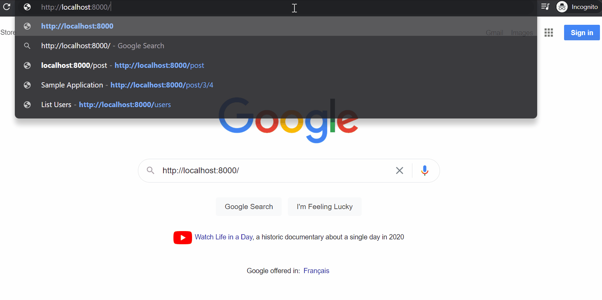

## Fetch and Sort Users

This is a simple Laravel application that fetches static hardcoded data and gives the control
to sort the data on each field and with chosen direction (ascending or descending).

The application is developed based on the laravel blog project template and has been tested only in
Chrome.
## Application in action

